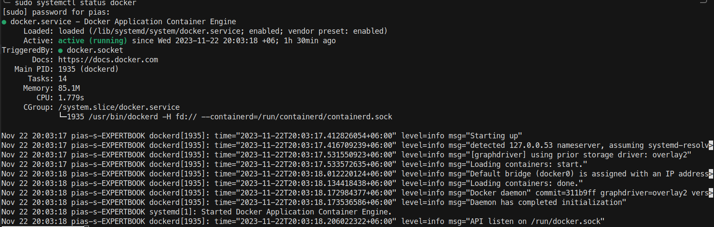
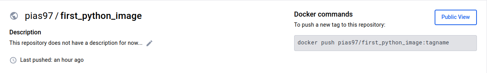
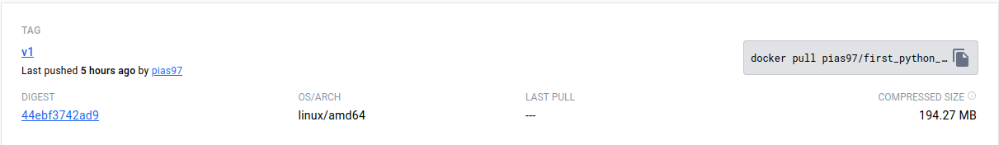

# Beginers guide to containerization using Docker on Ubuntu

A basic Django project has been used here to containerize. 

## SO first of all, What is a container?
A container is a bundle of Application, Application libraries required to run your application and the minimum system dependencies.


## What is Docker?
dummy text

## Why Docker?
dummy text

## INSTALL DOCKER

Detailed instructions to install Docker are provided in this link:-
https://docs.docker.com/get-docker/

For Demo, 

run these following commands to install docker on your ubuntu machine.

```
sudo apt update
sudo apt install docker.io -y
```
### Start Docker daemon

Start the daemon using the below command

```
sudo systemctl start docker
```

Use the below command to verify if the docker daemon is actually started and Active

```
sudo systemctl status docker
```

Here, docker is up and running

## Now let's get started

### Clone this repository and move to python-web-app 

```
git clone https://github.com/pias97/docker-practice.git
cd  python-web-app
```

### Login to Docker [Create an account with https://hub.docker.com/]

## Create a repository on dockerhub


I have created one here.

Now back to terminal, login here using same credential.
```
docker login
```

```
Login with your Docker ID to push and pull images from Docker Hub. If you don't have a Docker ID, head over to https://hub.docker.com to create one.
Username: _ _
Password: _ _
```


```
"Login Succeeded" will appear if credentials are fine.
```

### Everything is set, Let's build our first Docker Image

You need to change the username accoringly in the below command

```
docker build -t pias97/first_python_image:v1 .
```

Output of the above command

```
    dummy output
```
### Verify Docker Image is created

```
docker images
```

Output 

```
REPOSITORY                  TAG               IMAGE ID       CREATED         SIZE
pias97/first_python_image   v1                0eb9acd4b1fc   7 hours ago     508MB
moby/buildkit               buildx-stable-1   ee33f441bff7   4 weeks ago     172MB
tonistiigi/binfmt           latest            354472a37893   15 months ago   60.2MB
```
Here is our first image. Let's push it to our docker repository. 

```
docker push pias97/first_python_image:v1
```


Here it is pushed on the dockerhub repository.
 

Now let's run our first docker image on our machine. To do this, use the follwing command.

```
docker run -it pias97/first_python_image:v1
```

Let's check our running container by using this command

```
docker ps -a
```

Dummy Output
```
CONTAINER ID   IMAGE                           COMMAND                  CREATED       STATUS                        PORTS     NAMES
9c245398803d   moby/buildkit:buildx-stable-1   "buildkitd"              3 hours ago   Exited (137) 46 minutes ago             buildx_buildkit_elegant_hugle0
49a40b5095ad   pythonimage:v1                  "python3 manage.py r…"   7 hours ago   Exited (0) 5 hours ago                  strange_hawking
0729d9443797   0eb9acd4b1fc                    "python3 manage.py r…"   7 hours ago   Exited (0) 7 hours ago                  hungry_napier

```
We can get into the container through a shell by using this command. We can run using either container id or image name.

```
docker exec -it <container_id / Image_name> bash

for example,
docker exec -it 49a40b5095ad bash
```


SO here it is, our container is up and running. 

Now let's step one step further, notice the size of the our image showing on local machine is 508MB and pushed file size is 195MB. So the image size compressed on the while uploading. But even 508MB file is comparetively large, lets compress it by using the concept of multistage.

#### FOR NOW, docker image is compressed even further using multistaging and multiplatform compatibility is also there for amd64/arm64 architecture. Further details will be added, to learn these steps. ###
